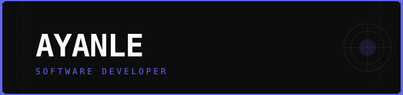

 

---

## 👋 About Me

I'm an aspiring software developer passionate about building cool things with code and always learning something new. Feel free to connect with me!

- ⚒️ **Currently building:** [Ratethe90](https://github.com/ayanle5/Ratethe90) 🔜
- 📧 **Email:** ayanle3645@gmail.com

---

## 🌐 Connect with Me

  &nbsp;
  

---

## ⚙️ Languages & Tools

  
  &nbsp;&nbsp;
  
  &nbsp;&nbsp;
  
  &nbsp;&nbsp;
  
  &nbsp;&nbsp;
  

---

## 📊 GitHub Stats

  

---

  

 

